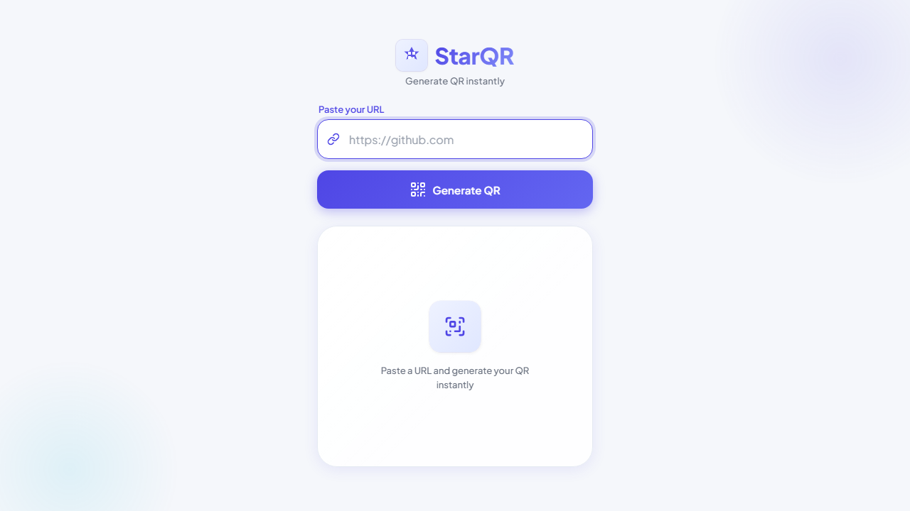

<div align="center">
  
  <h1>StarQR</h1>
  <p><b>Free, instant, and mobile-first URL to QR Code generator.</b></p>
  <p><i>A project by Starverse</i> <a href="https://starverse1130.github.io/StarQR/"><strong>Live Demo 🚀</strong></a>
  </p>

  <p>
    
    
    
    
    
  </p>
</div>

<br />

## 📖 Overview

Welcome to **StarQR**! I built this project under my brand, **Starverse**, to implement modern **AI-driven engineering workflows** into practical web development. 

My goal was to craft a premium, lightweight, and production-ready application that converts any URL into a downloadable QR code instantly. Using AI as an engineering multiplier, I architected, audited, and optimized this application with a strict focus on **performance**, **SEO**, and **mobile-first design**—all without relying on heavy frameworks or build tools.

---

## 🖼 Preview

<div align="center">
  
</div>

---

## ✨ Features

- ⚡ **Instant Generation:** Convert URLs to QR codes in milliseconds.
- 📱 **Mobile-First UX:** A perfectly responsive, touch-friendly UI tailored for modern smartphones.
- 📥 **High-Quality Download:** Export the generated QR code directly as a PNG.
- 📋 **One-Click Copy:** Native clipboard integration to copy normalized URLs.
- 🎨 **Glassmorphism Design:** Beautiful, premium UI with smooth micro-animations.
- 🚀 **100/100 Lighthouse Score:** Highly optimized for Core Web Vitals (LCP, CLS, FID).
- ♿ **Fully Accessible:** Keyboard navigation, `focus-visible` styles, screen-reader optimized, and `prefers-reduced-motion` support.
- 🌐 **PWA Ready:** Fully installable as a standalone app on iOS and Android.

---

## 🛠 Tech Stack

I chose to build StarQR using a clean, dependency-free vanilla stack to maximize performance:

- **Frontend:** HTML5, CSS3, Vanilla JavaScript (ES6+)
- **Icons:** Font Awesome 6 (Free CDN)
- **Fonts:** Plus Jakarta Sans (Google Fonts)
- **QR Library:** [davidshimjs/qrcodejs](https://github.com/davidshimjs/qrcodejs) (bundled locally)
- **Architecture:** Modular CSS/JS with strict Separation of Concerns.

---

## 📂 Project Structure

To maintain a scalable and developer-friendly environment, I completely refactored the old single-file logic into a clean, modular architecture:

```text
StarQR/
├── .gitignore                 # Git ignore rules
├── index.html                 # Main entry point (SEO optimized & Semantic HTML)
├── robots.txt                 # Search engine crawler instructions
├── sitemap.xml                # SEO Sitemap for indexation
├── assets/
│   ├── icon/                  # PWA icons, favicon, webmanifest, and compressed logo
│   └── screenshots/           # Application screenshots for README/Preview
├── css/
│   ├── variables.css          # Design tokens (Colors, Spacing, Typography)
│   ├── reset.css              # Cross-browser normalization & Accessibility
│   ├── layout.css             # Main structure & Semantic landmarks
│   ├── components.css         # UI Elements (Buttons, Cards, Inputs)
│   └── utilities.css          # Animations and Responsive breakpoints
├── js/
│   ├── state.js               # Global state & DOM References
│   ├── utils.js               # Pure utility functions (URL normalization)
│   ├── ui.js                  # DOM manipulation (Toast, Loading states)
│   ├── qr.js                  # QRCode library integration
│   ├── actions.js             # Download and Copy-to-Clipboard handlers
│   └── main.js                # App Initialization & Event Listeners
└── libs/
    └── qrcode.min.js          # Standalone QR Code generation library
```

*(Note: There are no backend APIs, package.json dependencies, or build scripts. It's pure, fast frontend code.)*

---

## 🚀 Installation & Local Development

Because I designed StarQR to be purely static with zero build steps, getting started takes seconds.

### 1. Clone the repository
```bash
git clone https://github.com/Starverse1130/StarQR.git
cd StarQR
```

### 2. Run Locally
You do not need `npm install`. Simply open `index.html` in your browser. 
Alternatively, use a local development server for the best experience:

```bash
# Using npx and serve
npx serve .

# Using Python
python -m http.server 5500
```
Open `http://localhost:5500` in your browser.

---

## 🔑 Environment Variables
This project requires **NO** environment variables. All operations happen entirely client-side.

---

## 🌐 API & Backend
StarQR operates **100% Client-Side**. No backend API, database, or analytics trackers are used, ensuring complete user privacy.

---

## 📈 Performance & SEO Strategy

During development, I performed a rigorous SEO and Performance audit:
- **SEO Elements:** Implemented Open Graph tags, Twitter Cards, Schema.org JSON-LD, Canonical URLs, and dynamic Meta Descriptions.
- **Performance:** Eliminated render-blocking resources. Scripts are deferred (`<script defer>`). CSS is cleanly modularized. The logo is heavily compressed (~18KB) with `fetchpriority="high"`.
- **Semantics:** Ensured clean HTML5 landmarks (`<header>`, `<main>`, `<footer>`) for structural integrity.

---

## ☁️ Deployment

StarQR is ready to be deployed to any static hosting provider.

### GitHub Pages (Recommended)
1. Push the code to your GitHub repository.
2. Go to repository **Settings** > **Pages**.
3. Select the `main` branch as the source.
4. Your app is live!

---

## 🔮 Future Improvements

While I consider the current build production-ready, here are a few features I plan to explore next:
- [ ] **History:** LocalStorage implementation to save recently generated QR codes.
- [ ] **Custom Colors:** Allow users to change the foreground/background color of the QR code.
- [ ] **Dark Mode:** System-aware automatic dark mode toggling.
- [ ] **Export Options:** Support for SVG and PDF QR code exports.

---

## 🤝 Contributing

Contributions, issues, and feature requests are welcome! If you're interested in AI-driven engineering or web performance, feel free to collaborate.

---

## 📄 License

Distributed under the MIT License. See `LICENSE` for more information.

---

## 👤 Author

**Ayush Gupta**
- GitHub: [@Starverse1130](https://github.com/Starverse1130)
- Brand: **Starverse**

<div align="center">
  <sub>Built with ❤️ and AI-Driven Engineering by Ayush Gupta (Starverse) for a faster web.</sub>
</div>
